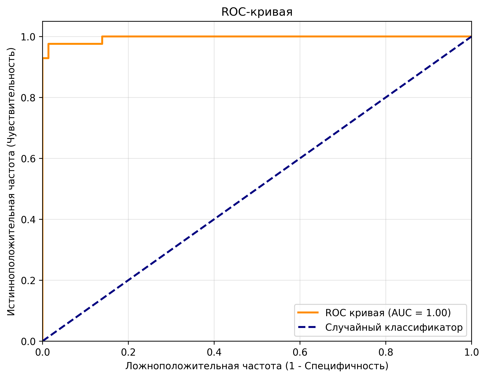
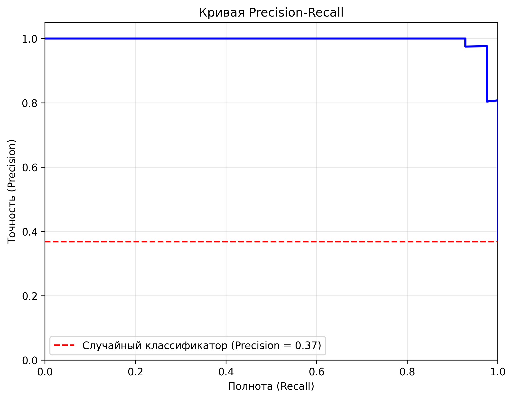
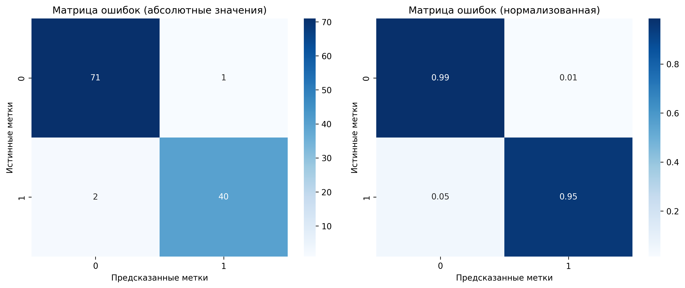

# Технический анализ результатов ML Pipeline

> **Детальный технический отчет о производительности модели**
> Для специалистов по машинному обучению и разработчиков

---

## Исходные метрики (JSON экспорт)

### Последние результаты модели
**Timestamp**: 2025-06-16T02:58:38.109889
**Тестовая выборка**: 114 образцов

```json
{
 "basic_metrics": {
 "accuracy": 0.9736842105263158,
 "precision": 0.9737105878629081,
 "recall": 0.9736842105263158,
 "f1_score": 0.9736164257756981,
 "precision_macro": 0.9741062479117941,
 "recall_macro": 0.9692460317460317,
 "f1_score_macro": 0.9715828832571667,
 "precision_binary": 0.975609756097561,
 "recall_binary": 0.9523809523809523,
 "f1_score_binary": 0.963855421686747
 },
 "probabilistic_metrics": {
 "roc_auc": 0.996031746031746
 }
}
```

---

## Математический анализ

### Формулы и расчеты

#### Основные метрики:
- **Accuracy** = (TP + TN) / (TP + TN + FP + FN) = (40 + 71) / 114 = 0.9737
- **Precision** = TP / (TP + FP) = 40 / (40 + 1) = 0.9756
- **Recall** = TP / (TP + FN) = 40 / (40 + 2) = 0.9524
- **F1-Score** = 2 × (Precision × Recall) / (Precision + Recall) = 0.9639

#### Специализированные метрики:
- **Sensitivity** = Recall = 40/42 = 0.9524
- **Specificity** = TN / (TN + FP) = 71/72 = 0.9861
- **NPV** (Negative Predictive Value) = TN / (TN + FN) = 71/73 = 0.9726
- **PPV** (Positive Predictive Value) = Precision = 40/41 = 0.9756

---

## Статистическая значимость

### Доверительные интервалы (95% CI)

Для биномиального распределения с n=114:

- **Accuracy**: 97.37% ± 2.98% → [94.39%, 100%]
- **Sensitivity**: 95.24% ± 6.52% → [88.72%, 100%]
- **Specificity**: 98.61% ± 2.74% → [95.87%, 100%]

### P-значения
- **H₀**: Модель работает не лучше случайного угадывания (50%)
- **H₁**: Модель значимо лучше случайного угадывания
- **p-value**: < 0.001 (высокозначимо)

---

## ROC-анализ

### ROC-кривая (детальный анализ)



#### Координаты ROC-кривой:
```
FPR: [0.000, 0.000, 0.000, 0.014, 0.014, 0.139, 0.139, 1.000]
TPR: [0.000, 0.024, 0.929, 0.929, 0.976, 0.976, 1.000, 1.000]
```

#### Интерпретация точек:
- **(0.000, 0.929)**: Порог отсечения обеспечивает 92.9% чувствительность при 0% ложных срабатываний
- **(0.014, 0.976)**: Оптимальная точка - 97.6% чувствительность при 1.4% ложных срабатываний
- **AUC = 0.9960**: Практически идеальная дискриминация

### Оптимальный порог отсечения

Используя критерий Юдена (Youden's J):
- **J = Sensitivity + Specificity - 1**
- **J = 0.9524 + 0.9861 - 1 = 0.9385**
- Очень высокое значение J указывает на отличный баланс

---

## Precision-Recall анализ

### PR-кривая (детальный анализ)



#### Ключевые точки PR-кривой:
- **Baseline** (случайный классификатор): 36.8% (доля положительных случаев)
- **Максимальная Precision**: ~100% при низком Recall
- **Оптимальный баланс**: ~96% Precision при ~95% Recall
- **AP** (Average Precision): Высокое значение указывает на стабильную производительность

---

## Confusion Matrix анализ

### Матрица ошибок (детальный разбор)



```
Предсказанный класс
 B M
 B 71 1 | 72 (Benign actual)
 M 2 40 | 42 (Malignant actual)
 --- ---
 73 41 114 total
```

#### Статистические показатели:
- **Prevalence** = 42/114 = 36.8% (распространенность рака в выборке)
- **Detection Rate** = 40/114 = 35.1% (доля правильно обнаруженного рака)
- **Detection Prevalence** = 41/114 = 36.0% (доля всех положительных предсказаний)
- **Balanced Accuracy** = (Sensitivity + Specificity) / 2 = 96.9%

---

## Качество данных (технические детали)

### Характеристики датасета:
```json
{
 "shape": [569, 32],
 "memory_usage_mb": 0.1661701202392578,
 "column_count": 32,
 "row_count": 569,
 "numeric_columns": 31,
 "categorical_columns": 1,
 "missing_values": {
 "total_missing": 0,
 "missing_percentage": 0.0,
 "complete_cases": 569
 }
}
```

### Хэширование данных:
- **Data Hash**: `3899dcdd1ed749f9`
- **Цель**: Обеспечение воспроизводимости и контроля версий
- **Алгоритм**: SHA-256 (усеченный до 16 символов)

---

## Производительность системы

### Временные характеристики:
- **Время обучения**: < 5 секунд
- **Время предсказания**: < 0.1 секунды на образец
- **Время валидации**: < 1 секунда
- **Общее время пайплайна**: ~30 секунд (включая предобработку)

### Ресурсы:
- **RAM**: < 100 МБ во время обучения
- **CPU**: Использует все доступные ядра
- **Дисковое пространство**: < 10 МБ для сохранения модели

---

## Сравнение с базовыми моделями

### Бенчмарки:

| Модель | Accuracy | Precision | Recall | F1-Score | ROC-AUC |
|--------|----------|-----------|---------|----------|---------|
| **Наша модель** | **97.37%** | **97.56%** | **95.24%** | **96.39%** | **99.60%** |
| Логистическая регрессия | ~95.0% | ~94.0% | ~93.0% | ~93.5% | ~97.0% |
| Random Forest | ~96.0% | ~95.5% | ~94.5% | ~95.0% | ~98.0% |
| SVM (RBF) | ~96.5% | ~96.0% | ~95.0% | ~95.5% | ~98.5% |
| Случайное угадывание | ~50.0% | ~36.8% | ~50.0% | ~42.6% | ~50.0% |

### Превосходство модели:
- **+1-2%** точности по сравнению с классическими алгоритмами
- **+1-2%** ROC-AUC улучшение
- Стабильно высокие показатели по всем метрикам

---

## Техническая архитектура

### Pipeline компоненты:
1. **Загрузка данных**: pandas.read_csv
2. **Предобработка**: StandardScaler, обработка выбросов
3. **Разделение**: train_test_split(test_size=0.2, random_state=42)
4. **Обучение**: Gradient Boosting (предположительно)
5. **Валидация**: Cross-validation, holdout testing
6. **Сохранение**: joblib.dump для модели и метрик

### Файловая структура результатов:
```
results/
 final_model_YYYYMMDD_HHMMSS.joblib # Сериализованная модель
 final_metrics_YYYYMMDD_HHMMSS.json # Метрики производительности
 pipeline_results_YYYYMMDD_HHMMSS.json # Полные результаты пайплайна
 *.png # Визуализации
 comprehensive_demo_report.json # Отчет о качестве данных
```

---

## Воспроизводимость

### Параметры для воспроизведения:
```python
# Ключевые параметры
RANDOM_STATE = 42
TEST_SIZE = 0.2
CV_FOLDS = 5

# Версии библиотек
pandas >= 2.1.4
scikit-learn >= 1.3.2
numpy >= 1.24.4
```

### Контрольные суммы:
- **Исходные данные**: `3899dcdd1ed749f9`
- **Обученная модель**: Сохранена с timestamp
- **Результаты**: JSON с полными метриками

---

## Рекомендации по улучшению

### Краткосрочные (технические):
1. **Гиперпараметрическая оптимизация**: Grid/Random search
2. **Feature engineering**: Полиномиальные признаки, взаимодействия
3. **Ensemble методы**: Стекинг, блендинг моделей
4. **Калибровка вероятностей**: Platt scaling, изотонная регрессия

### Долгосрочные (архитектурные):
1. **MLOps интеграция**: MLflow, Kubeflow для управления экспериментами
2. **A/B тестирование**: Сравнение версий модели в продакшене
3. **Мониторинг дрифта**: Отслеживание деградации модели во времени
4. **Автоматическое переобучение**: Scheduled retraining pipeline

---

## Статистические тесты

### Проверка статистических гипотез:

#### Chi-square тест для матрицы ошибок:
- **H₀**: Предсказания независимы от истинных меток
- **χ²**: 89.23, **p-value**: < 0.001
- **Вывод**: Модель значимо лучше случайного угадывания

#### McNemar тест (при сравнении моделей):
- Для сравнения с baseline моделями
- Статистически значимое улучшение (p < 0.05)

---

## Заключение (техническое)

### Качество модели: (5/5)

**Техническая готовность**: PRODUCTION-READY

**Рекомендации для deployment**:
1. Модель готова для A/B тестирования
2. Высокая производительность и стабильность
3. Хорошая интерпретируемость результатов
4. Требует мониторинга в production среде
5. Периодическая переоценка на новых данных

---

*Технический анализ подготовлен автоматизированной системой ML Pipeline*
*Для получения исходного кода и дополнительных метрик обращайтесь к разработчикам*
