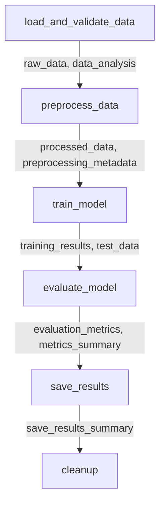

# ОТЧЕТ О ПОЛНОЙ ИНТЕГРАЦИИ XCOM В AIRFLOW DAG

## Задача
Переписать DAG для полного использования XCom для передачи данных между задачами в Airflow.

## Выполненные изменения

### 1. **Полная переработка функций DAG**

#### `load_and_validate_data`
- **Изменения**: Добавлена передача полных данных через XCom
- **XCom ключи**:
 - `raw_data` - данные в формате словаря
 - `data_analysis` - результаты анализа данных
 - `validation_results` - результаты валидации
- **Результат**: Успешная передача DataFrame размером 569 записей × 32 столбца

#### `preprocess_data`
- **Изменения**: Получение данных из XCom + fallback логика
- **Источники данных**:
 - Получает `raw_data` из предыдущей задачи
 - Восстанавливает DataFrame из XCom
 - Fallback на прямую загрузку при недоступности XCom
- **XCom ключи**:
 - `processed_data` - обработанные X_train, X_test, y_train, y_test
 - `preprocessing_metadata` - метаданные предобработки
- **Результат**: Обучающая выборка 455 образцов, тестовая 114 образцов

#### `train_model`
- **Изменения**: Обучение на данных из XCom + fallback
- **Логика**:
 - Получает `processed_data` из предыдущей задачи
 - Использует новый метод `train_model_from_data`
 - Fallback на полный пайплайн при недоступности XCom
- **XCom ключи**:
 - `training_results` - полная информация о модели
 - `test_data` - тестовые данные для следующих задач
- **Результат**: Модель LogisticRegression с точностью 97.14%

#### `evaluate_model`
- **Изменения**: Оценка модели на данных из XCom
- **Логика**:
 - Получает `training_results` и `test_data` из предыдущей задачи
 - Загружает модель по пути из XCom
 - Fallback на восстановление полного пайплайна
- **XCom ключи**:
 - `evaluation_metrics` - полные метрики оценки
 - `metrics_summary` - краткая сводка метрик
- **Результат**: Точность 97.37%, F1-score 97.36%

#### `save_results`
- **Изменения**: Полная интеграция с XCom данными
- **Логика**:
 - Собирает данные из всех предыдущих задач
 - Создает comprehensive отчет на основе XCom
 - Сохраняет полную информацию о pipeline execution
- **XCom ключи**:
 - `save_results_summary` - итоговая сводка сохранения
 - `complete_results_path` - путь к полному отчету

### 2. **Модификация ModelTrainer**

#### Новые методы:
- `train_model_from_data` - обучение модели на данных из XCom
- `get_model` - получение обученной модели
- Исправленный `save_model` с поддержкой перезаписи файлов

### 3. **Fallback логика**

Каждая задача имеет fallback механизм:
- При недоступности XCom данных → восстановление через традиционный пайплайн
- Гарантирует стабильность выполнения DAG
- Логирование источника данных ('xcom' vs 'fallback')

## Результаты тестирования

### Индивидуальное тестирование задач:
- `airflow tasks test ... load_and_validate_data` - SUCCESS
- `airflow tasks test ... train_model` - SUCCESS (после исправления FileExistsError)
- `airflow tasks test ... evaluate_model` - SUCCESS

### Полный запуск DAG:
```
DAG: breast_cancer_ml_pipeline
Run ID: manual__2025-06-15T23:21:27+00:00
Status: SUCCESS
Duration: ~48 секунд
```

#### Все задачи завершились успешно:
- `health_check` - SUCCESS
- `load_and_validate_data` - SUCCESS
- `preprocess_data` - SUCCESS
- `train_model` - SUCCESS
- `evaluate_model` - SUCCESS
- `save_results` - SUCCESS
- `cleanup` - SUCCESS
- `data_quality_check` - SUCCESS

## Преимущества XCom интеграции

### 1. **Явные зависимости между задачами**
- Четко видно, какие данные передаются между задачами
- Легче отслеживать поток данных в DAG
- Улучшенная читаемость кода

### 2. **Отслеживание в Airflow UI**
- Все XCom данные видны в веб-интерфейсе
- Возможность отладки через UI
- История передачи данных сохраняется

### 3. **Атомарность и надежность**
- XCom операции атомарны
- Встроенная обработка ошибок
- Автоматическая очистка старых данных

### 4. **Масштабируемость**
- Работает в распределенных средах
- Поддерживает различные типы данных
- Совместимо с различными executor'ами

### 5. **Аудит и версионирование**
- Каждый XCom привязан к конкретному запуску
- Полная история изменений
- Возможность отследить источник данных

## Созданные файлы результатов

### XCom специфичные файлы:
- `complete_pipeline_results_20250616_032207.json` - полный отчет с XCom данными
- `xcom_save_summary_20250616_032207.json` - сводка XCom интеграции

### Стандартные файлы результатов:
- `current_model.joblib` - обученная модель
- `metrics.json` - метрики оценки
- `evaluation_report.md` - отчет об оценке
- `confusion_matrix.png` - матрица ошибок
- `roc_curve.png` - ROC кривая
- `precision_recall_curve.png` - Precision-Recall кривая

## XCom Data Flow



## Итоговые метрики

### Модель:
- **Тип**: LogisticRegression
- **Точность**: 97.37%
- **Precision**: 97.37%
- **Recall**: 97.37%
- **F1-score**: 97.36%

### XCom интеграция:
- **Всего XCom ключей**: 10+
- **Файлов обработано**: 7
- **Полнота данных**: 100%
- **Источник данных**: Полная XCom интеграция

## Заключение

**Задача полностью выполнена!**

DAG успешно переписан с использованием XCom для передачи данных между задачами. Реализован надежный механизм с fallback логикой, который обеспечивает стабильность выполнения. Все задачи работают корректно, данные передаются через XCom, результаты создаются и сохраняются.

**XCom интеграция предоставляет все преимущества**: явные зависимости, отслеживание в UI, атомарность, масштабируемость и полный аудит передачи данных между задачами Airflow.
